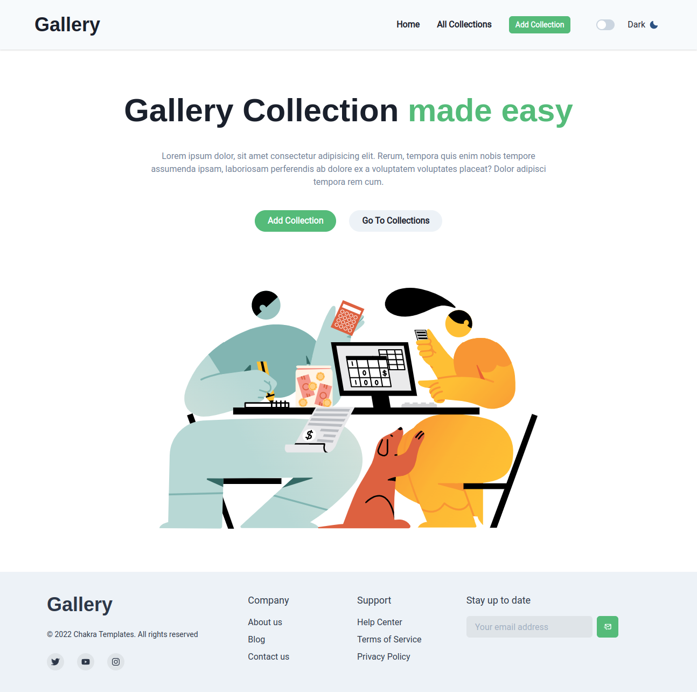
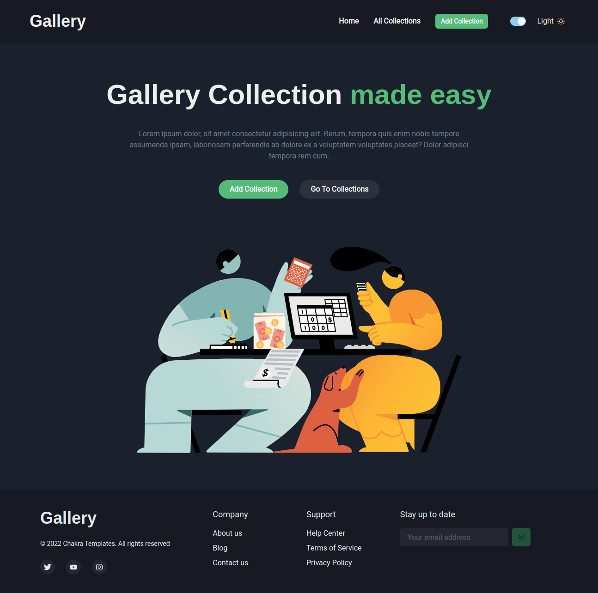

# Multi-page Gallery application.

## Links 🔗

- Solution URL: [Repository](https://github.com/lowesilvan/multi-page-gallery)
- Live Site URL: [GitHub Pages](https://lowesilvan.github.io/multi-page-gallery/)

## The challenge 💻

Users should be able to:

- Create a new collection with the following fields:
    a) Name of the collection
    b) Description
    c) Images in the collection
- After the Creation of the collection, the user should be redirected to the dashboard listing the new collection created.
- On click of the collection, you should be redirected to the route of that specific collection where you can view the content with the specified fields.
- You should be able to edit the collection.
- You can delete the collection that you create.
- Make sure that while creating your collection, fields should not remain empty i.e., there should be form validation in it with an appropriate message.

### Screenshot


<br>



### Built with

- [Chakra UI](https://chakra-ui.com/) - UI Library.
- Flexbox and Grid.
- [React](https://reactjs.org) - JS library.
- [React Router](https://reactrouter.com) - React library
- [Redex Toolkit](https://redux-toolkit.js.org) - State Manager

### Immediate Future Improvements

- Add Loading icons to buttons
- Add active states on NavLink
- Add more collection feature

### More about me

- LinkedIn - [@dt_lowe](https://www.linkedin.com/in/lowesilvan/)
- Frontend Mentor - [@lowesilvan](https://www.frontendmentor.io/profile/lowesilvan)

```
